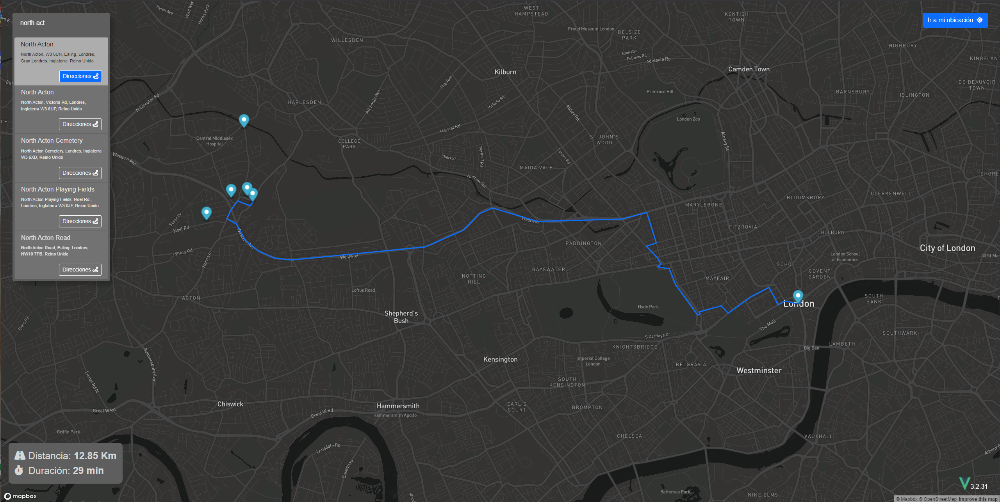

# MAPATH 🗺 - Rute travel time visualization

This proyect is an small application that calculates the route from your position to a selected point, also gives you the distance and travel time.
This proyect is built using Vue 3 with TypeScript and Vuex, serving a MapBox API.

## Quick Start 🚀

This proyect uses Yarn as package manager, so I'll let a quick guide to start in local.
But if u dont want to clone the repo, here is a [live demo](https://mapath.netlify.app/#/).

### Project setup

```
yarn install
```

### Compiles and hot-reloads for development

```
yarn serve
```

### Compiles and minifies for production

```
yarn build
```

### Lints and fixes files

```
yarn lint
```

## Sample Images 📦

|                   Web View                    |   Mobile View    |
| :-------------------------------------------: | :--------------: |
|  | work in progress |
